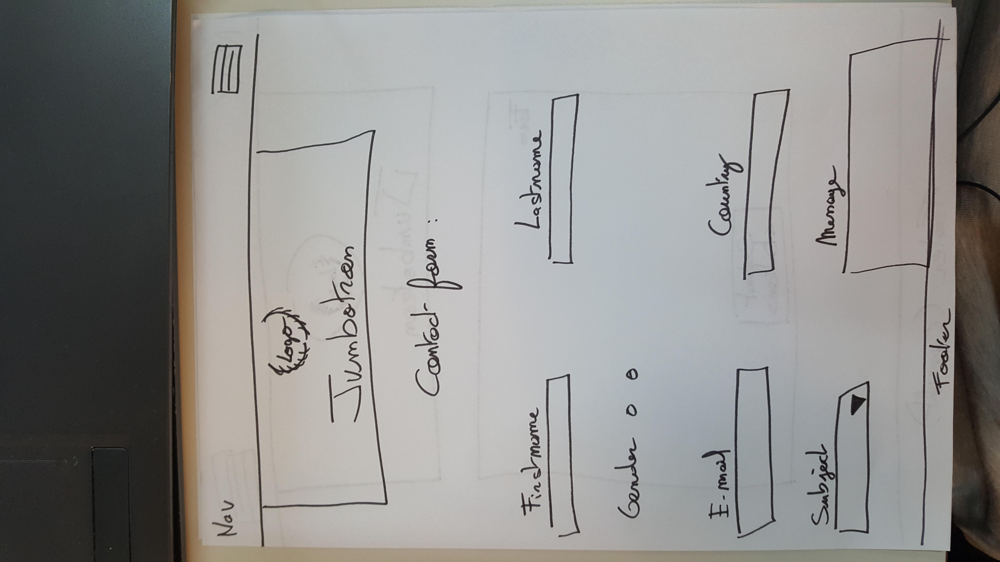

# Hackers Poulette 📄

## ◾ Features

<ul>
  <li>Hackers Poulette is a dynamic website.</li>
  <li>Pre-organized channels.</li>
  <li>Real time Chat.</li>
</ul>

<br>
<hr>
<br>

<p align="center">
  
</p>

<br>
<hr>
<br>

## ◾ Motivation

It has been launch the 💠02/12/2019💠 in the case of a school project (<a href="https://github.com/becodeorg" target="_blank">BeCode</a>).

Below, you will find our guidelines hosted on the school repo: 

▪️▪️▪️▪️▪️▪️▪️▪️▪️▪️▪️▪️▪️▪️▪️▪️▪️▪️▪️▪️▪️▪️▪️▪️▪️▪️▪️▪️▪️▪️▪️▪️▪️▪️▪️▪️▪️▪️▪️▪️▪️▪️▪️▪️▪️▪️▪️▪️▪️▪️▪️▪️▪️▪️▪️▪️▪️▪️▪️▪️▪️▪️▪️▪️▪️▪️▪️▪️▪️▪️▪️▪️▪️▪️▪️▪️▪️▪️▪️▪️▪️▪️▪️▪️▪️▪️▪️▪️▪️▪️▪️▪️▪️▪️▪️▪️▪️▪️▪️▪️▪️▪️▪️▪️▪️▪️▪️▪️▪️▪️▪️▪️▪️▪️▪️▪️▪️▪️▪️▪️▪️▪️▪️▪️▪️▪️▪️

== Missions objectives

At the end of this challenge you should have improved your:

* *semantical* HTML
* *accessibility* in HTML
* progressive enhancement
* PHP programming
* project planning
* mock-up creation

You should also be able to :

* display errors


== The mission

The company _Hackers Poulette ™_ sells Raspberry Pi accessory kits to build
yourself. They want to allow their users to contact their support team. Your
mission is to develop a *PHP* script *displaying a contact form* and *processing
the received answer* (sanitize, validate, answer the user).

image::./hackers-poulette-logo.png[Hackers Poulette Logo]

The form should be comprised of:

* name and lastname
* gender
* email address
* country
* subject (3 possibilities)
* message

NOTE: All field, except _subject_, have to be completed. The field _subject_
takes a default value of *others*.

=== Instructions

Must have:

* the project repository must include a mock-up
* the form *must have* semantical HTML
* the HTML *must be* accessible to the blinds
* in case of wrong input return the form with a visual error display
* display the error message near the correct input field
* the error message must be readable (helpful to users)
* the form has to be *sanitised* and *validated* (server side)
* if an answer validate, respond by email to a given address
* implement anti spam the technique of {honey}[honeypot]


▪️▪️▪️▪️▪️▪️▪️▪️▪️▪️▪️▪️▪️▪️▪️▪️▪️▪️▪️▪️▪️▪️▪️▪️▪️▪️▪️▪️▪️▪️▪️▪️▪️▪️▪️▪️▪️▪️▪️▪️▪️▪️▪️▪️▪️▪️▪️▪️▪️▪️▪️▪️▪️▪️▪️▪️▪️▪️▪️▪️▪️▪️▪️▪️▪️▪️▪️▪️▪️▪️▪️▪️▪️▪️▪️▪️▪️▪️▪️▪️▪️▪️▪️▪️▪️▪️▪️▪️▪️▪️▪️▪️▪️▪️▪️▪️▪️▪️▪️▪️▪️▪️▪️▪️▪️▪️▪️▪️▪️▪️▪️▪️▪️▪️▪️▪️▪️▪️▪️▪️▪️▪️▪️▪️▪️▪️▪️

<br>
<hr>
<br>

## ◾ Tasks

- [x] Initialize the ReadMe and the trello.
- [x] Work on the main project.
- [ ] Launch the app.

ℹ️ For further informations, please make sure to visit our **Trello** [board](https://trello.com/b/NSohfKPi/real-time-chat) (only in french).

<br>
<hr>
<br>

## ◾ Build status

📲 V1.0.1
Logs
   - Readme initialized.
   - ...
   - ...
   - ...

<br>
<hr>
<br>

## ◾ Screenshots
<p align="center">

</p>

<br>
<hr>
<br>

### Api architecture

<br>
<hr>
<br>

## ◾ Tech/framework used

1. Front-end
   - [Vue.js](https://vuejs.org/)
   - [Bootstrap](https://getbootstrap.com/)
   
2. Back-end
   - [Node.js](https://nodejs.org/en/)
     - [Express.js](https://expressjs.com/)
     - [Socket.io](https://socket.io/)

<br>
<hr>
<br>

## ◾ Code Example

```
function test() {
  console.log("This is a test for code input?");
}
```
<br>
<hr>
<br>

## ◾ Credits
- [Mathieu Kruk](https://github.com/MathieuKruk)

<br>
<hr>
<br>

## ◾ License

OpenSource | Free

<br>
<hr>
<br>

✍️ Readme Author: Mathieu Kruk 
